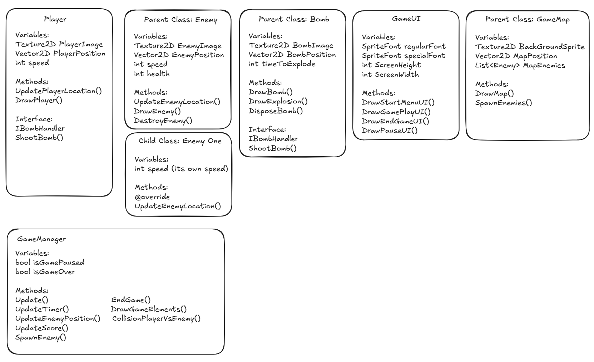
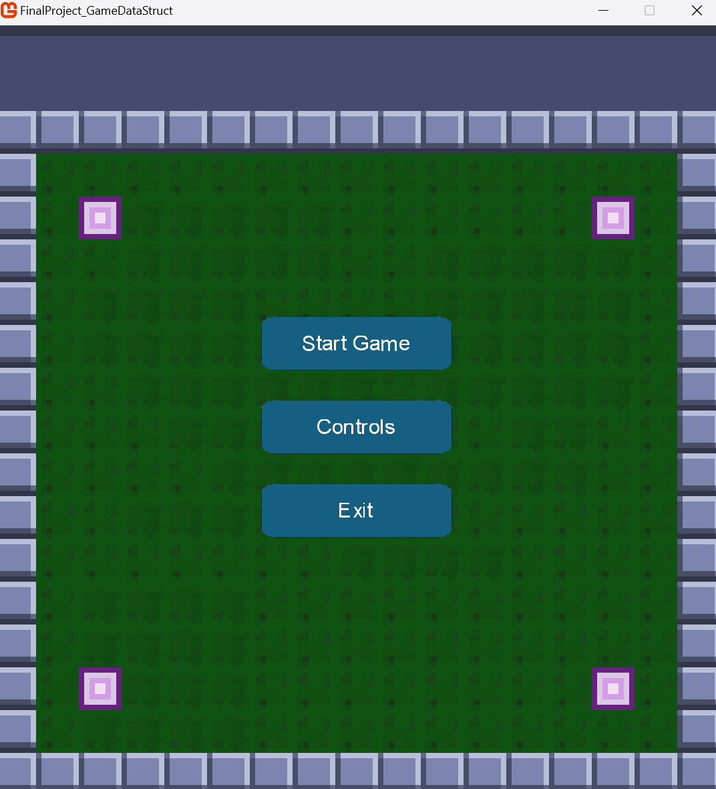
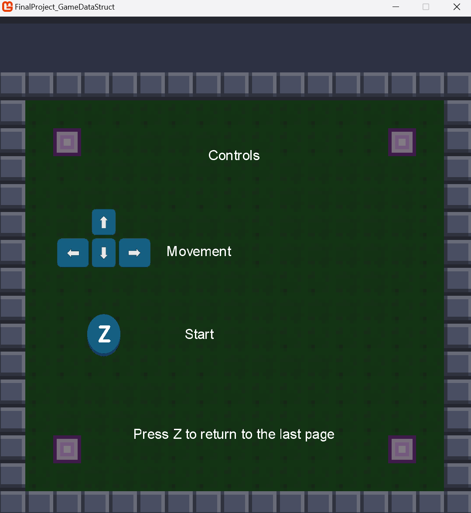
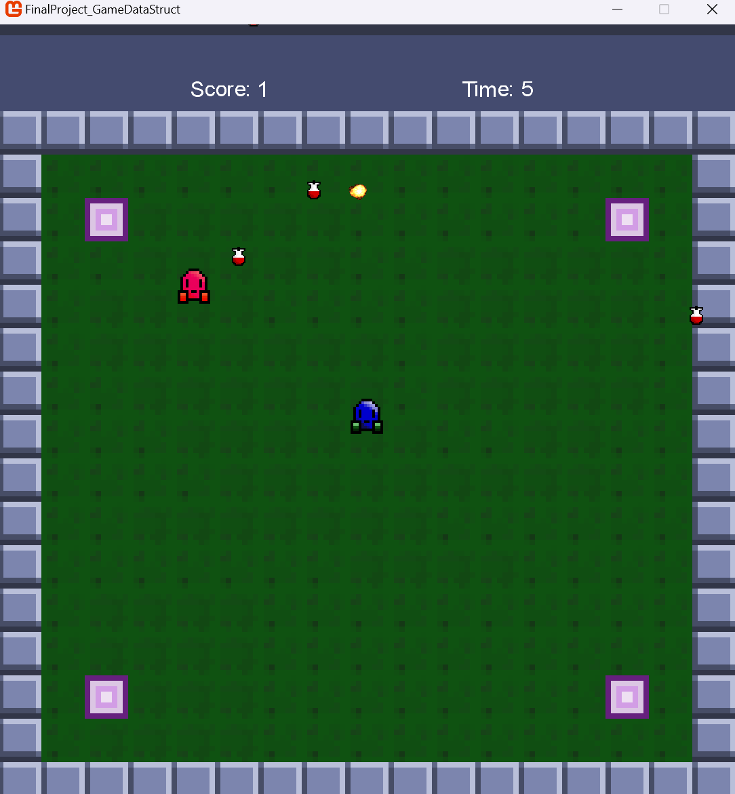
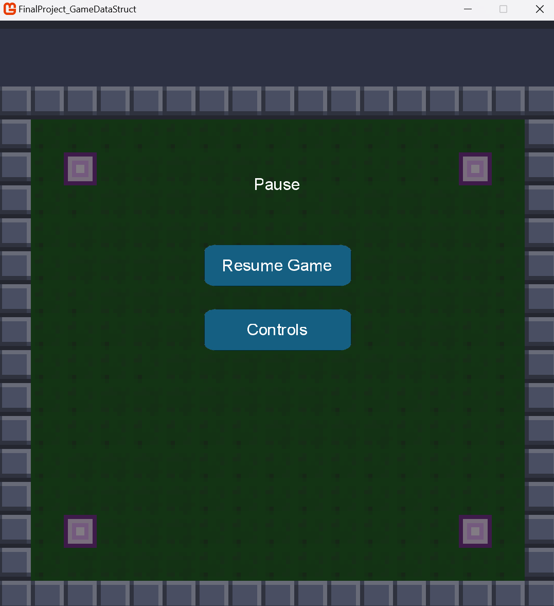

# Final project for Game Programming with Data Structure

## About the project

This is a game made as a final project for the subject Game Programming with Data Structures for third term of Computer Programming at Conestoga.

The game is a Survival Game, the idea is: 

The player should try to survive as much as they can.
As the game goes on, the score will increase as the missiles hit the ground.
Mean while the enemies will try to catch the player.
If either, enemies or missiles hit the player, the game is over.

### Project Images

The initial plan for the structure of the classes:

</img>

The start menu:

</img>

The controls menu:

</img>

The gameplay screen:

</img>

The pause menu:

</img>

### Built with

As part of our evaluation, the game should be built with MonoGame.

## Game mechanics

- [x] Survival Game
- [x] Player movement: the player can move around the defined area of the map.
- [x] Player animation: the player have animations for all the movements it does.
- [x] Sound: we added sound music and sound effects for some actions within the game.
- [x] Missiles: missiles will fall from time to time to hit random locations at the map.
- [x] Menu: we added a start menu,with an option to start the game, an option to show the controls of the game and an option to exit.
- [x] Pause: we also added the possibility for the player to pause the game.
- [x] Enemy: enemies will follow the player around the map. They will also spawn from time to time.
- [x] Enemy death: enemies will be destroyed when hit by a missile.

## License

Distributed under the MIT License. See [LICENSE](./LICENSE) for more information.

## Technical documentation

For more details about the project log, see the [project log](./docs/README.md).
